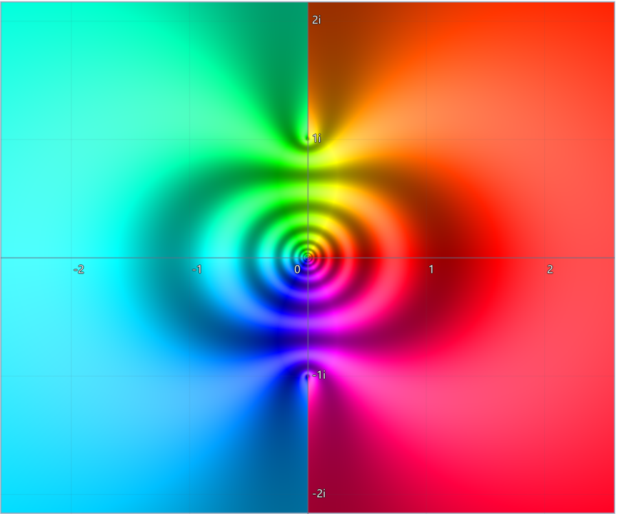
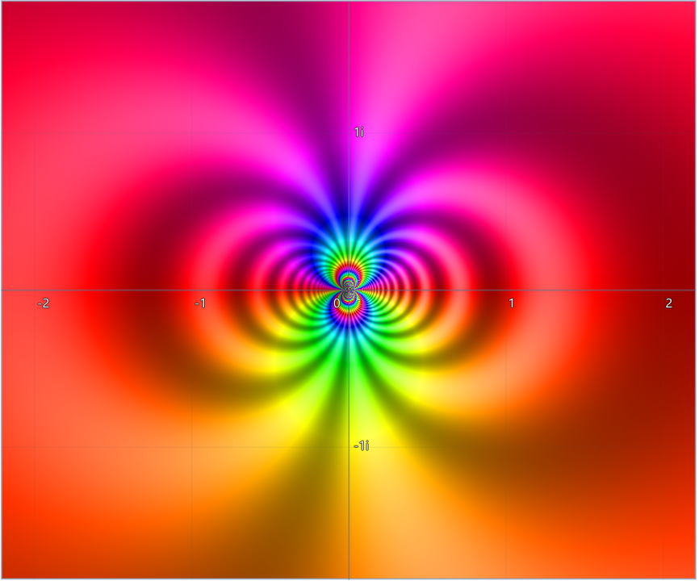
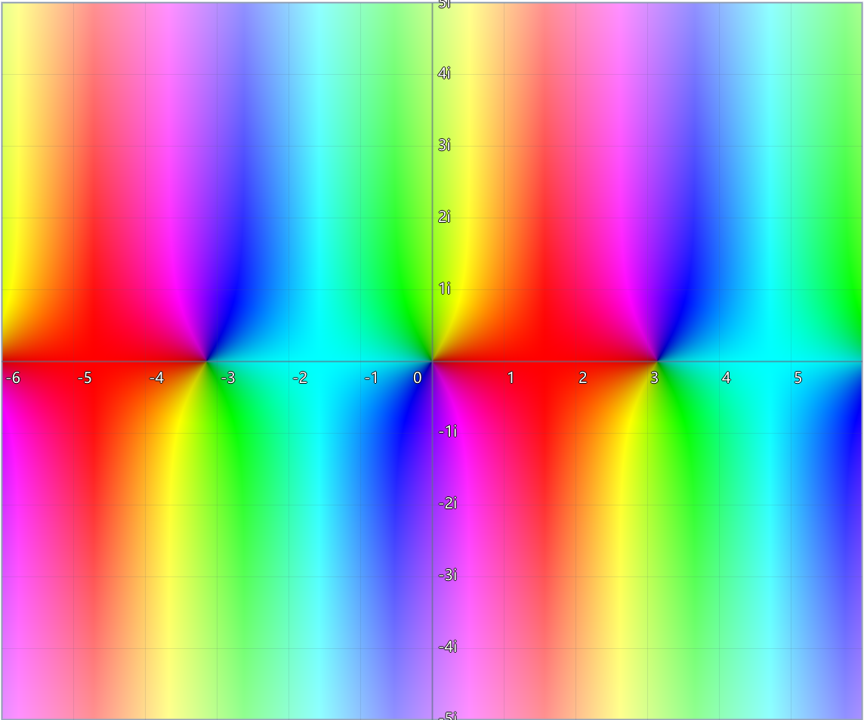

# ComplexVisualizer 2026 - Runtime Compiler Engine

一个基于 C++、OpenGL (GLSL) 与 Dear ImGui 构建的高性能、实时交互式**复变函数可视化引擎**。

该项目通过在 CPU 端进行手写词法与语法分析来动态构建**抽象语法树（AST）**，并在运行时将其横向翻译、爆破编译为 **GPU 片段着色器（Fragment Shader）代码**，实现了复数域代数与高阶超越函数在复平面上的**逐像素高性能并行域着色渲染（Domain Coloring）**。

---

## 🚀 核心技术亮点：跨端 JIT 编译与 GPU 复数超越函数求值引擎

本程序最大的技术闪光点在于**开创性地实现了一套从“用户字符串输入”到“显卡原生全网格并行解算”的跨端即时编译（JIT）闭环**：

### 1. 任意复杂表达式的解构与横向动态翻译（AST 跨端映射）
* **免编译运行时热加载**：用户在前端输入的任何数学公式字符串（如 `atan(z)`、`exp(1/z)`），在运行时通过手写的递归下降语法分析器（Recursive Descent Parser）即时解构。
* **多态语法树双工发射**：系统在内存中组装出多态抽象语法树（AST）。它不仅通过 `evaluate()` 接口在 CPU 端使用 `std::complex<double>` 计算高精度探测值，更通过 `toGLSL()` 接口在运行时直接将表达式横向翻译为符合 OpenGL 着色器规范的复数函数调用链（例如将 `^` 幂运算安全降维翻译为 `complex_pow`）。

### 2. 工业级 GPU 原生复数域超越函数库（数学拓延的硬核实现）
由于显卡原生的 GLSL 着色器语言纯粹为实数的几何渲染设计，没有复数及其超越函数的概念。为此，本项目在 `complex.frag` 中**自建了一整套符合复变函数解析拓延（Analytic Continuation）理论的 GPU 数学算子库**：
* **基础代数底座**：通过解析几何公式，用 `vec2` 的 `.x`（实部）和 `.y`（虚部）严格重构了复数域的加、减、乘、除法（`complex_div` 等）。
* **欧拉公式推广**：完美利用欧拉公式将指数、对数、正余弦及双曲函数拓延至复数域（例如：sin(x+iy) = sin(x)cosh(y) + i*cos(x)sinh(y)）。
* **复对数映射反三角函数**：程序彻底摆脱了传统几何的束缚，走纯粹的解析几何对数映射路径。反正弦与反正切完全基于复数对数方程解算：
  `arcsin(z) = -i * ln(i*z + sqrt(1 - z^2))`
  `arctan(z) = (i / 2) * ln((i + z) / (i - z))`
  通过精准分离实部虚部，在显卡流水线内实现了极高难度的全功能初等复变函数求值。

### 3. 多值函数分支切割与周期收拢稳定性算法（Branch Cut Precision）
* 复数超越函数普遍属于多值函数，极易在复平面特定的射线（分支切割线）两侧引发计算相位的跳跃或断层。
* 本程序在 GPU 级反正切算法中，针对对数差值进行了严密的周期收拢约束，代码中通过 `diff.y = mod(diff.y + PI, 2.0 * PI) - PI;` 完美抹平了跌出主值区间的相位缠绕。
* 配合 `1e-9` 零点平滑保护与 `max(0.0, ...)` 负域防御机制，彻底斩断了 GPU 计算中可能引发的 `NaN` 或 `Infinity` 碎点，确保渲染出的彩色复平面景观具备科学严谨的连续性。

---

## ✨ 经典复变函数渲染画廊 (Gallery)

提示：你可以在项目的 `images/` 目录下放置你的软件截图，并在这里展示它们：

### 1. 反正切函数 f(z) = atan(z)
> 展示了在复平面纵轴 `1i` 与 `-1i` 两个奇点附近完美的色彩汇聚漩涡，以及经过分支切割修正后连续、无割裂的极坐标色彩域。


### 2. 指数基本奇点 f(z) = exp(1/z)
> 在原点 `z=0` 处存在本质奇点（Essential Singularity），展现出无限循环、高频交织的绚丽彩虹色域，直观显化了皮卡定理的数学魅力。


### 3. 复数正弦波 f(z) = sin(z)
> 展示了实数周期性与虚数双曲溢出性的完美结合，在横向上色彩呈现周期性更迭，在纵向上随着模长膨胀逐步转为高亮。


---

## 🛠️ 核心功能特性

### 1. 双重高级数学色彩映射模式（Color Mapping）
为了全方位展现复变函数的几何美学与多维数学性质，系统在 GPU 端实现了两种截然不同的数学着色机制：
* **极坐标域模式（Polar Mode / 色彩域着色）**：
    * **辐角映射色相**：将复数结果的辐角完美映射到 0度 ~ 360度的 HSL 色轮上。正实轴呈红色，负实轴呈青色，正虚轴呈黄绿色，能够直观地通过颜色循环次数展示零点和极点的阶数。
    * **模长映射明暗**：模长大小动态决定颜色的明暗过渡，靠近零点变暗，靠近极点变亮。
    * **对数模长等高线**：支持开启对数尺度的模长等高线纹理（基于 `sin(10.0 * logR)` 算法），以细腻的明暗涟漪波动定量化呈现函数值在奇点附近的急剧膨胀或湮灭速率。
* **直角坐标网格模式（Cartesian Mode）**：
    * 将输出复数 f(z) = u + iv 的实部 u 和虚部 v 剥离，分别独立映射到 RGB 颜色的红（R）和绿（G）通道上。
    * **映射风格切换**：支持基于正弦波的平滑网格过渡以及基于线性周期折叠（Modulo）的高频几何交织纹理。
    * **象限指示分量**：可选启用蓝色通道（B）的四级特异性亮度，精准指示当前坐标变换后落在复平面的哪一个象限（第一象限 B=0，第四象限 B=255）。

### 2. 高性能指针探测器（Pointer Detector）
* **鼠标实时捕获解算**：当鼠标跨入渲染大画板时，系统会实时捕捉鼠标像素位置并逆矩阵解算出当前复平面对应的坐标 z。
* **双坐标系同步数值输出**：在 UI 面板中同时以**代数形式 (a+bi)** 和 **极坐标形式 (r ∠ θπ)** 实时解码并显示数学输入值 z 与经过函数变换后的输出值 f(z) 结果，为边界探测与复变函数性质研究提供高精度的数据支撑。

### 3. 交互式二维复平面视口
* **无级平移与缩放**：支持鼠标左键按住拖拽平移视口中心（改变渲染中心），以及鼠标滚轮进行超高自由度的无级缩放（zoom 机制）。
* **自适应数轴刻度网格**：背景数轴网格采用动态步长算法，网格线会根据当前缩放比例自动在 0.1、0.5、1.0、5.0、20.0、100.0 之间智能切换刻度，并在边缘处提供防溢出锁死排版的虚数单位 i 标签。


---

## 📂 项目文件结构

```text
ComplexVisualizer/
├── shaders/
│   ├── complex.frag       # 核心片元着色器模板（包含GPU复数库与动态渲染槽）
│   └── complex.vert       # 顶点着色器（裁剪空间坐标映射）
├── src/
│   ├── ComplexParser.cpp  # 递归下降解析器及AST节点具体求值实现
│   ├── ComplexParser.h    # 解析器核心头文件及AST结构声明
│   └── main.cpp           # 程序主入口（窗口生命周期、ImGui面板、着色器热编译链接核心控制）
├── .gitignore             
├── CMakeLists.txt         # CMake构建核心脚本
└── CMakeSettings.json     # Visual Studio CMake环境配置文件
